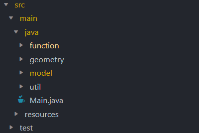

# Motivation 

Hello! 👋 

This project is my solution to following problem:


Coming from a Mathematics background, 
I take great pleasure in solving complex problems 🔢

This "snapping" algorithm gave me the opportunity of applying my
programming and reasoning to a real use-case. 

I will provide details on how I analyzed and broke down the problem,
an overview on how this solution works, a breakdown of the code and test,
and finally some further optimization techniques. 

# VIEWING ORDER 

The best order for first viewing this project, showcasing the logic flow 
and implementation steps, is as follows 

        1. README
        2. Coord
        3. Polygon
        3a. (PolygonTest)
        4. PointData 
        5. GeometryUtil 
        5a. (GeometryUtilTest)
        6. SnapResult
        7. ResultBuilder
        8. DragMove
        8a. (Main)

# High-Level Overview

First of all, lets discuss how this all works together. 🔧

Functionality was *split* into relevant packages. The basis of the code is the 
`Coord`, `Polygon` and `GeometryUtil` classes.

A **list of Coord objects** is used to *store* the list of vertices of shapeA, 
which the Polygon class then uses to *generate a list of midpoints* and 
*equally spaced points* between each consecutive vertex. 

The generation of these lists allow *easy implementation* and *testing* of 
methods to check which vertex / midpoint / point in shape A is closest to a vertex
in shape B. These methods are **static** and *encapsulated* in the `GeometryUtil` class. 

The `PointData` class allows the closest vertex / midpoint / point to be stored 
and returned as well as the relevant **distance**.

The `SnapResult` class was is responsible for *storing* the **required data** 
that `dragMove()` will need to return. 
Also, the `ResultBuilder` class contains a method to *generate* the boilerplate 
code needed to *create* and *set* the `SnapResult` object to the correct result.

With all the *elements* of the algorithm handled, the `dragMove() `function 
simply checks if the first snapping condition is met via the 
`calculateDistance()` function, if not the code moves onto the *next* condition, 
and continues until a snapping condition is met or the algorithm determines 
that *no snapping occurs*. 

```java
  // Check if any vertex of A is within 20 points to any vertex of B
  if (GeometryUtil.calculateClosestVertex(shapeA, shapeB).getDistance() <= VERTEX_SNAP) {

      PointData pointData = GeometryUtil.calculateClosestVertex(shapeA, shapeB);
      return ResultBuilder.buildResult(pointData, result, "vertex", verticesB);
  }

  // Check if any midpoint of A is within 15 points to any vertex of B
  else if (GeometryUtil.calculateClosestMidpoint(shapeA, shapeB).getDistance() <= MIDPOINT_SNAP){

      PointData pointData = GeometryUtil.calculateClosestMidpoint(shapeA, shapeB);
      return ResultBuilder.buildResult(pointData, result, "midpoint", verticesB);
  }

  // Check if any point of A is within 10 points to any vertex of B
  else if (GeometryUtil.calculateClosestPoint(shapeA, shapeB).getDistance() <= POINT_SNAP){

      PointData pointData = GeometryUtil.calculateClosestPoint(shapeA, shapeB);
      return ResultBuilder.buildResult(pointData, result, "point", verticesB);
  }

  // No distance criteria met
  else {
      snapDetails += NO_SNAP;
      result.setSnapDetails(snapDetails);
      System.out.println(snapDetails);
      return result;
  }
```

If a snapping condition is met, the relevant points and distance are stored in 
a `PointData` object which is then *parsed* to the `ResultBuilder`, 
along with a string detailing  *which type of snapping occurred*. 

`ResultData` then builds the `SnapResult`, including the snapDetails string 
and *calculating* the *new snapped vertices of B* utilizing 
the `calculatedSnapped`() method in GeometryUtil.

The main method only served as a way to run some **dummy data**, 
and showcases each condition of the algorithm activating.

# Approach Reasoning

As with every problem, to start I broke the required functionality 
down into bite-sized chunks I could code a solution for.

For example, in order to check if a vertex of A was within 20 points 
of a vertex of B, this was my train of thought 🚂: 

```
--> will need to find the closest vertex
  --> will need to compare distances between vertices of shape A and shape B
    --> will need to calculate distances between vertices
      --> will need to define a vertex
```

Which led to the following development process: 

```
--> Vertex class
  --> Polygon class
    --> calculateDistance() method 
      --> calculateClosestVertex() method
```

Similarly, I de-constructed each isolated problem into a
codable solution. I.e, in order to *compare distances* between
midpoints and vertices, I would need to first
 **generate a list of midpoints**.

This resulted in the format of my project, where functionality 
was encapsulated into specific packages. 



I decided that a `Polygon` class would be useful to **encapsulate methods** for
*generating* midpoints and line points. 

This way, the later code remains short and neat, while also allowing 
**easier testing, refactoring** and further changes. 

In regard to *generating points between vertices*, I opted to not just focus 
on integral points on a line and instead generate **equally spaced points**. 

This approach made sense to me as we'd want shape B to **snap** fairly close 
to the position it is in when we meet the *third snapping criteria*. 
Also, depending on shape A there could be *very little* to *no* integral points 
between a pair of vertices.

`GeometryUtil` then provides the **analytic tools** needed to *run* the algorithm. 
Again, I thought it best to encapsulate all the geometric methods in 
one utility class for *code neatness, and easy testing / changes*. 

Originally, I just had the methods in GeometryUtil returning the closest distance 
between the desired type of co-ordinate. But of course, the dragMove() function 
has to *return information* on **which vertex** has activated the **snap condition**. 

This lead me to incorporate the `PointData` class into the methods of `GeometryUtil`. 
This way, the methods that *calculate* the distance between the relevant co-ordinates 
can also **return each co-ordinate** as well as the **distance** inside a PointData object.

The same line of thinking is what led to the `SnapResult` class, 
which allows the *required data* to be **easily handled**.

The *introduction* of the `ResultBuilder` class happened when I noticed most 
of the code for the dragMove function was *repeated* in each if-elif block. 💩

Moving this *boilerplate* code to a class to **generate** this each time was 
simple as the only difference in the code (whether the snap was a vertex / midpoint / point) 
could be *parsed* in as a String.

# SPEED-OPTIMIZATION RECOMMENDATIONS

An obvious cause of speed issues in this code is the inclusion of nested-loops,
specifically when calculating closest points. 

One workaround would be to not actually calculate the distance between 
all vertices / midpoints / points. 
For example, if shape A is significantly higher than shape B, 
we can confidently say that the bottom vertices of shape B will not need 
to be checked to find the closest distance. 

The same logic can be applied if shape A is significantly more left, right, 
or below B. 
By utilizing an algorithm to check for extreme points we'd be able to 
determine whether a considerable amount of distance checks could be eliminated. 

Another method of optimizing the distance calculations between vertexes 
would be to incorporate spatial indexing techniques.
Specifically, I believe that quad trees would be the best choice for this 
problem due to its efficient indexing for point data, 
and its search function which can be modified to return the closest node of a 
given point. This would take the calculateClosest..() methods from O(n^2) to 
O(Log(N)) time complexity, where n is the number of points and 
N is the size of the distance. 
   
