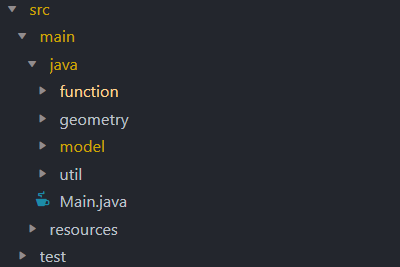

# Motivation 

Hello! 👋 

This project is my solution to following problem:


Coming from a Mathematics background, 
I take great pleasure in solving complex problems 🔢

This "snapping" algorithm gave me the opportunity of applying my
programming and reasoning to a real use-case. 

I will provide details on how I analyzed and broke down the problem,
an overview on how this solution works, a breakdown of the code and test,
and finally some further optimization techniques. 

# High-Level Overview

First of all, lets discuss how this all works together. 🔧

Functionality was *split* into relevant packages. The basis of the code is the 
`Coord`, `Polygon` and `GeometryUtil` classes.

A **list of Coord objects** is used to *store* the list of vertices of shapeA, 
which the Polygon class then uses to *generate a list of midpoints* and 
e*qually spaced points* between each consecutive vertex. 

The generation of these lists allow *easy implementation* and *testing* of 
methods to check which vertex / midpoint / point in shape A is closest to a vertex
in shape B. These methods are **static** and *encapsulated* in the `GeometryUtil` class. 

The `PointData` class allows the closest vertex / midpoint / point to be stored 
and returned as well as the relevant **distance**.

The `SnapResult` class was is responsible for *storing* the **required data** 
that `dragMove()` will need to return. 
Also, the `ResultBuilder` class contains a method to *generate* the boilerplate 
code needed to *create* and *set* the `SnapResult` object to the correct result.

With all the *elements* of the algorithm handled, the `dragMove() `function 
simply checks if the first snapping condition is met via the 
`calculateDistance()` function, if not the code moves onto the *next* condition, 
and continues until a snapping condition is met or the algorithm determines 
that *no snapping occurs*. 

```java
  // Check if any vertex of A is within 20 points to any vertex of B
  if (GeometryUtil.calculateClosestVertex(shapeA, shapeB).getDistance() <= VERTEX_SNAP) {

      PointData pointData = GeometryUtil.calculateClosestVertex(shapeA, shapeB);
      return ResultBuilder.buildResult(pointData, result, "vertex", verticesB);
  }

  // Check if any midpoint of A is within 15 points to any vertex of B
  else if (GeometryUtil.calculateClosestMidpoint(shapeA, shapeB).getDistance() <= MIDPOINT_SNAP){

      PointData pointData = GeometryUtil.calculateClosestMidpoint(shapeA, shapeB);
      return ResultBuilder.buildResult(pointData, result, "midpoint", verticesB);
  }

  // Check if any point of A is within 10 points to any vertex of B
  else if (GeometryUtil.calculateClosestPoint(shapeA, shapeB).getDistance() <= POINT_SNAP){

      PointData pointData = GeometryUtil.calculateClosestPoint(shapeA, shapeB);
      return ResultBuilder.buildResult(pointData, result, "point", verticesB);
  }

  // No distance criteria met
  else {
      snapDetails += NO_SNAP;
      result.setSnapDetails(snapDetails);
      System.out.println(snapDetails);
      return result;
  }
```

If a snapping condition is met, the relevant points and distance are stored in 
a `PointData` object which is then *parsed* to the `ResultBuilder`, 
along with a string detailing  w*hich type of snapping occurred*. 

`ResultData` then builds the `SnapResult`, including the snapDetails string 
and *calculating* the *new snapped vertices of B* utilizing 
the `calculatedSnapped`() method in GeometryUtil.

The main method only served as a way to run some **dummy data**, 
and showcases each condition of the algorithm activating.

# Approach Reasoning

As with every problem, to start I broke the required functionality 
down into bite-sized chunks I could code a solution for.

For example, in order to check if a vertex of A was within 20 points 
of a vertex of B, this was my train of thought 🚂: 

```
--> will need to find the closest vertex
  --> will need to compare distances between vertices of shape A and shape B
    --> will need to calculate distances between vertices
      --> will need to define a vertex
```

Which led to the following development process: 

```
--> Vertex class
  --> Polygon class
    --> calculateDistance() method 
      --> calculateClosestVertex() method
```

Similarly, I de-constructed each isolated problem into a
codable solution. I.e, in order to *compare distances* between
midpoints and vertices, I would need to first
 **generate a list of midpoints**.

This resulted in the format of my project, where functionality 
was encapsulated into specific packages. 



I decided that a `Polygon` class would be useful to **encapsulate methods** for
*generating* midpoints and line points. 

This way, the later code remains short and neat, while also allowing 
**easier testing, refactoring** and further changes. 

In regard to *generating points between vertices*, I opted to not just focus 
on integral points on a line and instead generate **equally spaced points**. 

This approach made sense to me as we'd want shape B to **snap** fairly close 
to the position it is in when we meet the *third snapping criteria*. 
Also, depending on shape A there could be *very little* to *no* integral points 
between a pair of vertices.

`GeometryUtil` then provides the **analytic tools** needed to *run* the algorithm. 
Again, I thought it best to encapsulate all the geometric methods in 
one utility class for *code neatness, and easy testing / changes*. 

Originally, I just had the methods in GeometryUtil returning the closest distance 
between the desired type of co-ordinate. But of course, the dragMove() function 
has to *return information* on **which vertex** has activated the **snap condition**. 

This lead me to incorporate the `PointData` class into the methods of `GeometryUtil`. 
This way, the methods that *calculate* the distance between the relevant co-ordinates 
can also **return each co-ordinate** as well as the **distance** inside a PointData object.

The same line of thinking is what led to the `SnapResult` class, 
which allows the *required data* to be **easily handled**.

The *introduction* of the `ResultBuilder` class happened when I noticed most 
of the code for the dragMove function was *repeated* in each if-elif block. 💩

Moving this *boilerplate* code to a class to **generate** this each time was 
simple as the only difference in the code (whether the snap was a vertex / midpoint / point) 
could be *parsed* in as a String.